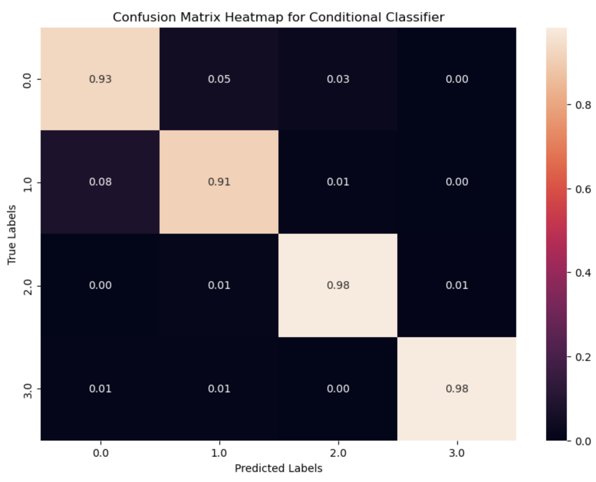
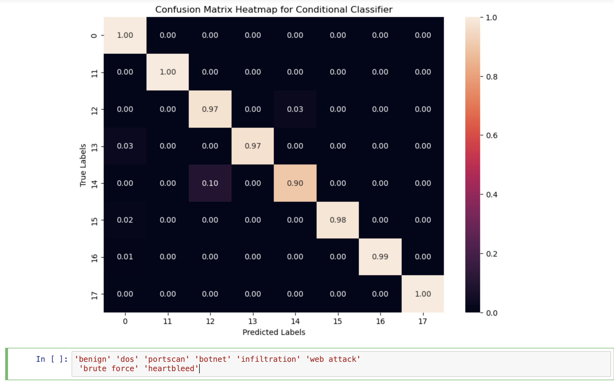

# 5Gcore

## Description 

This project focuses on creating machine learning models for detecting 5G network traffic anomalies. It consists of two separate models:

* One dedicated to analysing PFCP (Packet Forwarding Control Protocol) traffic.
* The other focused on detecting anomalies in general UDP and TCP traffic.
  
The project is divided into the following main components:
* PfcpFlowMeter.py – A Python script automatically converts .pcap files (captured network traffic) into .csv files by analysing PFCP communications between SMF and UPF in 5G networks.
* attacks/ – A directory containing example attack traffic performed on the 5G network, specifically targeting the interface between UPF and SMF.
* models/ – This folder contains two machine learning models:
    * One trained on PFCP traffic only.
    * One trained on general UDP/TCP traffic.
 
## How to run
1. Prepare the Environment
Make sure you have the required dependencies installed. You can install them using:

`pip install -r requirements.txt`

Note: You must also have tshark installed and added to your system's PATH. On Ubuntu, you can install it using:

`sudo apt-get install tshark`

2. Convert PCAP Files
To convert .pcap files to .csv for PFCP traffic analysis:

`python PfcpFlowMeter.py <path_to_pcap_folder> <output_folder> --interval 120`

Example:

`python PfcpFlowMeter.py ./pcaps ./output --interval 120`

This will generate .csv files with PFCP message counts and time-based segmentation.

## Results

The models were trained and tested on real network traffic containing both normal and attack scenarios.

### PFCP Model:
Focuses on analysing control plane messages between UPF and SMF.
Trained on time-windowed PFCP message frequencies.
Evaluated on a multi-class classification problem with four classes:
0 - Normal, 1 - Session Deletion Attack, 2 - Session Modification Attack, 3 - Session Establishment Attack.

#### Performance:

  

Overall, high classification accuracy and low misclassification rates. 

Based on the confusion matrix:
* Normal traffic (class 0) was correctly classified 93% of the time.
* Deletion attacks (class 1) were correctly classified in 91% of cases.
* Modification attacks (class 2) achieved 98% accuracy.
* Establishment attacks (class 3) also achieved 98% accuracy.
  
Very low cross-class confusion, indicating a robust model.

### TCP and UDP Model:
Focuses on analysing network flow behaviour over TCP and UDP protocols. Trained on time-windowed features extracted from flow metadata (e.g., packet count, byte count, duration).Evaluated on a multi-class classification problem with 8 classes:

0 - benign, 11 - dos, 12 - portscan, 13 - botnet, 14 - infiltration, 15 - web attack, 16 - brute force, 17 - heartbleed.

Performance:

  

Overall, the model demonstrates strong classification performance across most attack types.

* Benign traffic (class 0): 100% correctly classified.
* DoS attacks (class 11): 100% accuracy.
* Portscans (class 12): 97% accuracy with minimal confusion.
* Botnets (class 13): 97% accuracy; a small amount of misclassification as benign.
* Infiltration (class 14): 90% accuracy; slight confusion with portscan.
* Web attacks (class 15): 98% accuracy.
* Brute force (class 16): 99% accuracy.
* Heartbleed (class 17): 100% correctly classified.

Very low inter-class confusion highlights the model's robustness in distinguishing nuanced attack behaviours.

